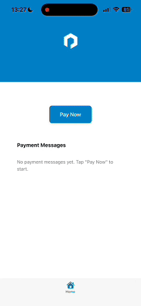

# Payabli React Native Payment Integration

A complete React Native demonstration of how to integrate Payabli's embedded payment component using a bottom sheet modal and WebView communication.

## 🎯 Overview

This project demonstrates how to integrate Payabli's embedded payment solution into a React Native application. The integration uses a **bottom sheet modal** containing a **WebView** that loads your hosted payment page, with communication handled via the **postMessage API**.

## 🎬 Demo

See the Payabli integration in action:



## 🏗️ Architecture

```
┌────────────────────────────────────────┐
│             React Native App           │
│  ┌───────────────────────────────────┐ │
│  │         Bottom Sheet Modal        │ │
│  │  ┌──────────────────────────────┐ │ │
│  │  │           WebView            │ │ │
│  │  │  ┌─────────────────────────┐ │ │ │
│  │  │  │    Your Payment Page    │ │ │ │
│  │  │  │ ┌─────────────────────┐ │ │ │ │
│  │  │  │ │ Payabli Component   │ │ │ │ │
│  │  │  │ └─────────────────────┘ │ │ │ │
│  │  │  └─────────────────────────┘ │ │ │
│  │  └──────────────────────────────┘ │ │
│  └───────────────────────────────────┘ │
└────────────────────────────────────────┘
            │
            │ postMessage API
            ▼
     Payment Results & Events
```

### Communication Flow

1. **User triggers payment** → React Native opens bottom sheet with WebView
2. **WebView loads** your hosted payment page containing Payabli component
3. **User completes payment** → Payabli component processes transaction
4. **Payment result** → Sent via `postMessage` to React Native
5. **React Native handles result** → Shows success/error alerts and closes modal

## 🚀 Quick Start

### Prerequisites

- React Native development environment
- Expo CLI (if using Expo)
- Node.js 18+
- A web server to host your payment page

### 1. Clone and Setup

```bash
git clone <repository-url>
cd payabli-expo-demo
npm install
```

### 2. Host Your Payment Page

**Critical Step**: You must host the `payment-page/index.html` file on your own web server.

```bash
# Copy the payment page to your web server
cp payment-page/index.html /path/to/your/webserver/payment.html
```

Update the Payabli configuration in your hosted file:

- Replace the `token` with your actual Payabli token
- Configure `entryPoint` with your business identifier
- Adjust payment amounts and customer data as needed

### 3. Update WebView URL

In `components/PaymentSheet.tsx`, update the WebView source to point to your hosted payment page:

```typescript
<WebView
  source={{
    uri: "https://your-domain.com/payment-page", // ← Update this URL
  }}
  // ... other props
/>
```

### 4. Run the App

```bash
# Start the development server
npx expo start

# Or for bare React Native
npx react-native run-ios
npx react-native run-android
```

## 🛠️ Implementation Guide

### Step 1: Install Dependencies

```bash
npm install @gorhom/bottom-sheet react-native-webview react-native-reanimated react-native-gesture-handler
```

### Step 2: Setup Payment Context

Create a global context to manage payment state across your app:

```typescript
// contexts/PaymentSheetContext.tsx
import React, { createContext, useContext, useState } from "react";
import { Alert } from "react-native";

interface PaymentSheetContextType {
  isVisible: boolean;
  showPaymentSheet: () => void;
  hidePaymentSheet: () => void;
  onPaymentSuccess: (data: any) => void;
  onPaymentError: (error: string) => void;
}

export const PaymentSheetProvider = ({ children }) => {
  const [isVisible, setIsVisible] = useState(false);

  const showPaymentSheet = () => {
    setIsVisible(true);
  };

  const hidePaymentSheet = () => {
    setIsVisible(false);
  };

  const onPaymentSuccess = (data) => {
    Alert.alert("Payment Successful!", `Transaction ID: ${data.transactionId}`);
    setIsVisible(false);
  };

  const onPaymentError = (error) => {
    Alert.alert("Payment Failed", error);
    setIsVisible(false);
  };

  return (
    <PaymentSheetContext.Provider
      value={{
        isVisible,
        showPaymentSheet,
        hidePaymentSheet,
        onPaymentSuccess,
        onPaymentError,
      }}
    >
      {children}
    </PaymentSheetContext.Provider>
  );
};

export const usePaymentSheet = () => useContext(PaymentSheetContext);
```

### Step 3: Create Payment Sheet Component

```typescript
// components/PaymentSheet.tsx
import BottomSheet, { BottomSheetView } from "@gorhom/bottom-sheet";
import { WebView } from "react-native-webview";

const PaymentSheet = ({
  isVisible,
  onClose,
  onPaymentSuccess,
  onPaymentError,
}) => {
  const handleWebViewMessage = (event) => {
    try {
      const data = JSON.parse(event.nativeEvent.data);

      if (data.status === "success") {
        onPaymentSuccess(data);
      } else if (data.status === "error") {
        onPaymentError(data.message || "Payment failed");
      }
    } catch (error) {
      onPaymentError("Invalid response from payment form");
    }
  };

  return (
    <BottomSheet
      index={isVisible ? 0 : -1}
      snapPoints={["70%"]}
      enableDynamicSizing={true}
      detached={true}
      onChange={(index) => index === -1 && onClose()}
    >
      <BottomSheetView>
        <WebView
          source={{ uri: "https://your-domain.com/payment.html" }}
          onMessage={handleWebViewMessage}
          javaScriptEnabled={true}
          domStorageEnabled={true}
        />
      </BottomSheetView>
    </BottomSheet>
  );
};
```

### Step 4: Setup Root Layout

Render the PaymentSheet at the root level to ensure it appears above tab bars:

```typescript
// app/_layout.tsx
import { PaymentSheetProvider } from "@/contexts/PaymentSheetContext";
import PaymentSheet from "@/components/PaymentSheet";

export default function RootLayout() {
  return (
    <PaymentSheetProvider>
      <Stack>
        <Stack.Screen name="(tabs)" options={{ headerShown: false }} />
      </Stack>
      <PaymentSheet />
    </PaymentSheetProvider>
  );
}
```

### Step 5: Use in Your Screens

```typescript
// app/(tabs)/index.tsx
import { usePaymentSheet } from "@/contexts/PaymentSheetContext";

export default function PaymentScreen() {
  const { showPaymentSheet } = usePaymentSheet();

  return (
    <TouchableOpacity onPress={showPaymentSheet}>
      <Text>Pay Now</Text>
    </TouchableOpacity>
  );
}
```

## 📄 Payment Page Configuration

### HTML Structure

Your hosted payment page should include:

```html
<!DOCTYPE html>
<html>
  <head>
    <meta
      name="viewport"
      content="width=device-width, initial-scale=1.0, maximum-scale=1.0"
    />
    <title>Payment</title>
  </head>
  <body>
    <div id="pay-component-1"></div>
    <button id="submit-btn">Process Payment</button>

    <script src="https://embedded-component-sandbox.payabli.com/component.js"></script>
    <script>
      const payabliConfig = {
        type: "methodEmbedded",
        rootContainer: "pay-component-1",
        token: "YOUR_PAYABLI_TOKEN",
        entryPoint: "YOUR_BUSINESS_IDENTIFIER",

        functionCallBackSuccess: function (response) {
          const message = {
            status: "success",
            message: `Payment successful: ${response.responseData.resultText}`,
            transactionId: response.responseData.transactionId,
            responseData: response.responseData,
          };

          // Send result to React Native
          if (window.ReactNativeWebView) {
            window.ReactNativeWebView.postMessage(JSON.stringify(message));
          }
        },

        functionCallBackError: function (errors) {
          const message = {
            status: "error",
            message: "Payment processing error occurred",
            errors: errors,
          };

          // Send error to React Native
          if (window.ReactNativeWebView) {
            window.ReactNativeWebView.postMessage(JSON.stringify(message));
          }
        },
      };

      const payComponent = new PayabliComponent(payabliConfig);

      document
        .getElementById("submit-btn")
        .addEventListener("click", function () {
          payComponent.payabliExec("pay", {
            paymentDetails: {
              totalAmount: 100.0,
              categories: [{ label: "payment", amount: 100.0, qty: 1 }],
            },
            customerData: {
              firstName: "John",
              lastName: "Doe",
              billingEmail: "john.doe@example.com",
            },
          });
        });
    </script>
  </body>
</html>
```

### Required Configuration

1. **Token**: Replace with your actual Payabli token
2. **Entry Point**: Set to your business identifier
3. **Payment Details**: Configure amounts and customer data
4. **Callbacks**: Ensure `postMessage` is called for both success and error cases

## 🔧 Customization

### Styling the Bottom Sheet

```typescript
const styles = StyleSheet.create({
  bottomSheet: {
    zIndex: 1000,
    elevation: 1000,
  },
  contentContainer: {
    flex: 1,
    backgroundColor: "white",
    minHeight: 450,
  },
});
```

### Payment Amounts

Update the payment details in your hosted payment page:

```javascript
payComponent.payabliExec("pay", {
  paymentDetails: {
    totalAmount: 250.0, // Total amount
    serviceFee: 10.0, // Optional service fee
    categories: [
      { label: "Product", amount: 200.0, qty: 1 },
      { label: "Shipping", amount: 40.0, qty: 1 },
    ],
  },
  customerData: {
    firstName: "Jane",
    lastName: "Smith",
    billingEmail: "jane.smith@example.com",
  },
});
```

## 🐛 Troubleshooting

### Common Issues

1. **Bottom sheet appears behind tab bar**

   - Ensure PaymentSheet is rendered at root level
   - Use `detached={true}` prop on BottomSheet

2. **WebView not loading**

   - Check HTTPS requirement for production
   - Verify payment page URL is accessible

3. **postMessage not working**

   - Ensure `javaScriptEnabled={true}` on WebView
   - Check for `window.ReactNativeWebView` availability

4. **Payment component not initializing**
   - Verify Payabli script is loaded
   - Check token and entryPoint configuration

### Debug Mode

Enable console logging in your payment page:

```javascript
functionCallBackSuccess: function(response) {
  console.log("Payment success:", response);
  // ... postMessage code
},

functionCallBackError: function(errors) {
  console.error("Payment error:", errors);
  // ... postMessage code
},
```

## 📚 Dependencies

- `@gorhom/bottom-sheet`: ^5.1.6
- `react-native-webview`: ^13.13.5
- `react-native-reanimated`: ^3.17.4
- `react-native-gesture-handler`: ^2.24.0

## 🔒 Security Notes

1. **Always use HTTPS** for your hosted payment page in production
2. **Validate payment results** on your backend before fulfilling orders
3. **Store sensitive tokens** securely (not in client-side code)
4. **Implement proper error handling** for all payment scenarios

---

## Development

### Running the Demo

```bash
# Install dependencies
npm install

# Start the development server
npx expo start

# Run on specific platform
npx expo run:ios
npx expo run:android
```

### Project Structure

```
├── app/
│   ├── (tabs)/
│   │   └── index.tsx          # Main payment demo screen
│   └── _layout.tsx            # Root layout with PaymentSheet
├── components/
│   └── PaymentSheet.tsx       # Bottom sheet component
├── contexts/
│   └── PaymentSheetContext.tsx # Global payment state
├── payment-page/
│   └── index.html             # Payment page to host on your server
└── README.md                  # This file
```
